# Warspear trade bot

## Requirements
* [Python 3.8.16](https://www.python.org/downloads/release/python-3816/)
* [Tesseract OCR](https://github.com/UB-Mannheim/tesseract/wiki)
* Windows OS

## Configuration
Put your tesseract path to main.py

Template for config.json in config directory:
```json
{
  "windows": [
    "Warspear Online"
  ],
  "messages": [
    ["msg1", 8],
    ["msg2", 10],
    ["msg3", 5]
  ],
  "trade": {
    "current_amount": 200,
    "price": 20,
    "mask": "item_mask",
    "delay": 0.001
  },
  "click": {
    "delay": 0.1,
    "step": 100,
    "hold": {
      "0": 0,
      "100": 4.36,
      "200": 6.13,
      "300": 7.35,
      "400": 8.49
    }
  },
  "timeout": 60
}
```

## Configure game
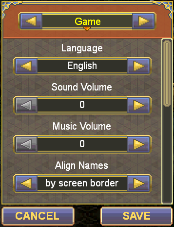
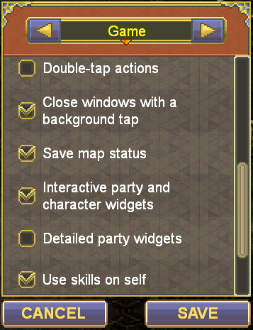
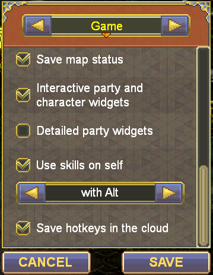
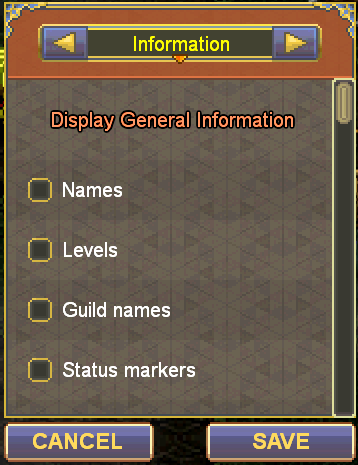
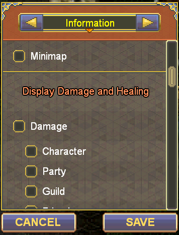
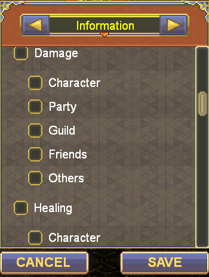
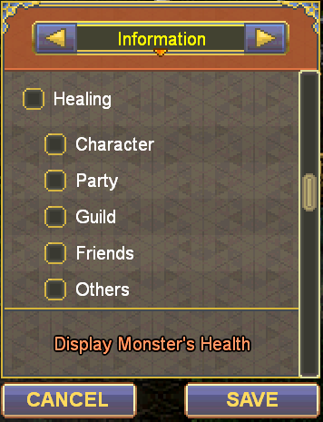
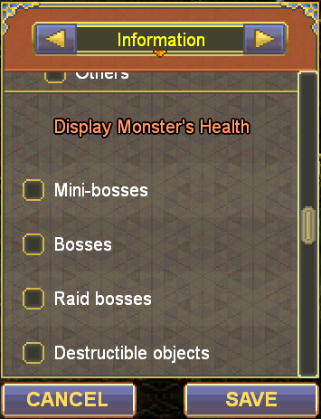
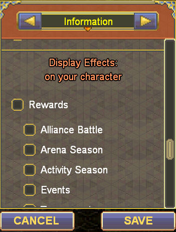
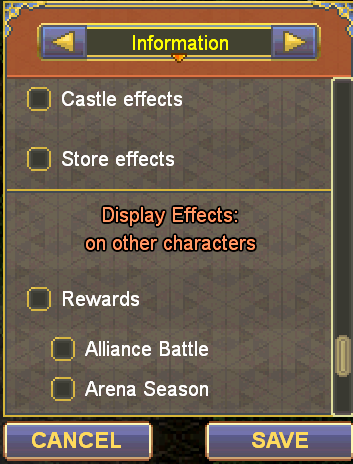
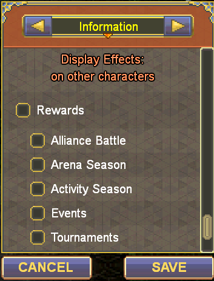
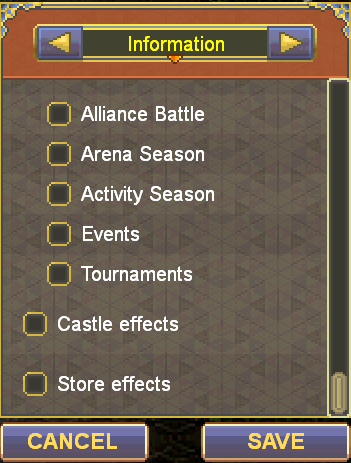
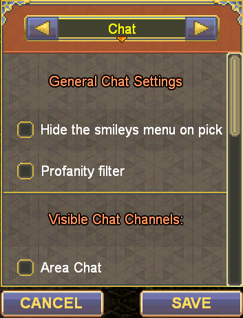
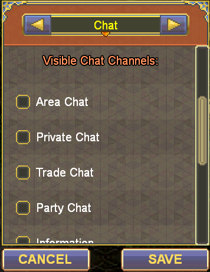
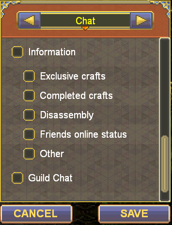
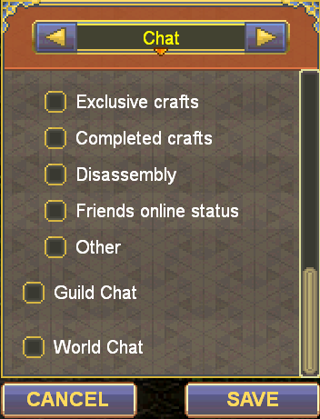
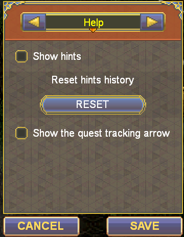
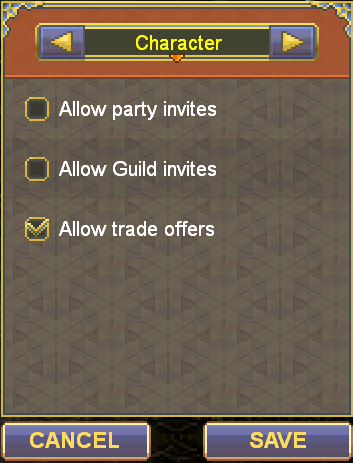
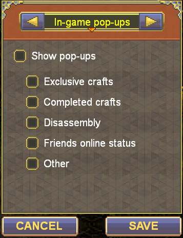
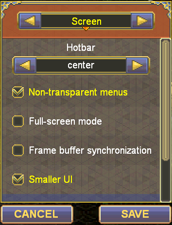
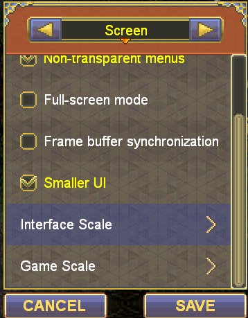

## GAME SCREEN SIZE MUST BE MINIMUM AS POSSIBLE
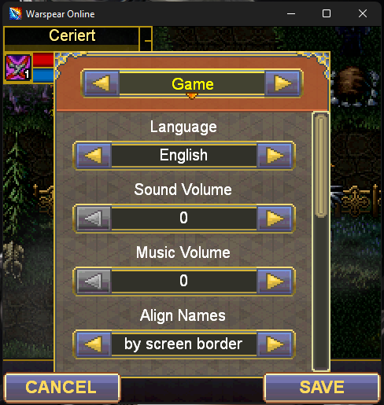
## Install & Run
```bash
pip install -r requirements.txt
python main.py
```